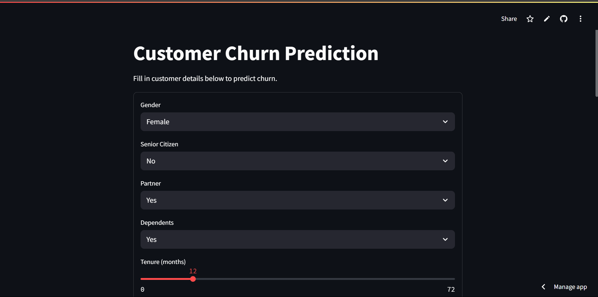

# 🧠 Customer Churn Prediction - MLOps Project

This project is an end-to-end **MLOps pipeline** that trains multiple machine learning models to predict customer churn, selects the best-performing one, and serves it via a FastAPI and Streamlit UI. The pipeline includes **CI/CD** with GitHub Actions and **automatic UI deployment** with Streamlit Cloud.

---

## 🖼️ Preview UI

The following is a display of the Streamlit application which is used to predict customer churn visually and interactively:



---

## 📁 Project Structure

```
customer-churn-mlops/
├── models/                   # Saved models and preprocessing artifacts
│   ├── model.pkl
│   ├── encoder.pkl
│   ├── scaler.pkl
│   ├── columns.pkl
│   └── best_model_name.pkl
├── src/
│   ├── train.py              # Model training script
│   ├── preprocess.py         # Preprocessing function
│   └── api.py                # FastAPI service
├── app.py                    # Streamlit UI
├── requirements.txt          # Dependencies
├── .github/workflows/
│   └── main.yml              # GitHub Actions workflow (CI)
├── data/
│   └── customer_churn.csv    # Dataset
└── README.md
```

---

## 🚀 Features

- 📊 Trains **3 models**: Random Forest, Decision Tree, Logistic Regression
- 🏆 Automatically selects and saves the **best-performing model**
- ⚙️ Uses `scaler`, `encoder`, and `columns.pkl` to keep inference consistent
- 🔁 Fully automated **CI** with GitHub Actions (train model on push)
- 🌐 Deployed UI with **Streamlit Cloud** (CD) for live prediction

---

## 📦 Setup Instructions (Local)

1. Clone the repository:

```bash
git clone https://github.com/yourusername/customer-churn-mlops.git
cd customer-churn-mlops
```

2. Create virtual environment:

```bash
python -m venv venv
source venv/bin/activate  # or .\venv\Scripts\activate on Windows
```

3. Install dependencies:

```bash
pip install -r requirements.txt
```

4. Train model:

```bash
python -m src.train
```

5. Run FastAPI (Swagger UI):

```bash
uvicorn src.api:app --reload
```

6. Run Streamlit UI:

```bash
streamlit run app.py
```

---

## ✅ Continuous Integration (CI)

GitHub Actions will automatically retrain the model every time you push code to the `main` branch.

Location: `.github/workflows/main.yml`

---

## ✅ Continuous Deployment (CD)

The Streamlit UI is automatically deployed and updated when new changes are pushed to the repo.

Live URL: https://mlops-churn.streamlit.app/

---

## 🧪 Testing

You can test your pipeline by:
- Sending a request to `/predict` on FastAPI Swagger UI
- Or using the Streamlit UI to fill in a customer form and get prediction

---

